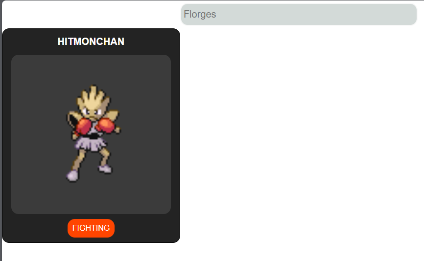

# Pokémon Finder
https://pokemon-api-brown-six.vercel.app/

  

## Descrição

Pokémon Finder é uma aplicação web que permite aos usuários pesquisar informações sobre seus Pokémon favoritos. A aplicação consome dados da [PokéAPI](https://pokeapi.co/) para exibir detalhes como o nome, tipo e sprite dos Pokémon.

## Funcionalidades

- Pesquisar Pokémon pelo nome
- Exibir detalhes do Pokémon, incluindo nome, tipos e sprite
- Layout responsivo e interface amigável

## Tecnologias Utilizadas

- Angular
- TypeScript
- HTML
- CSS
- [PokéAPI](https://pokeapi.co/)
